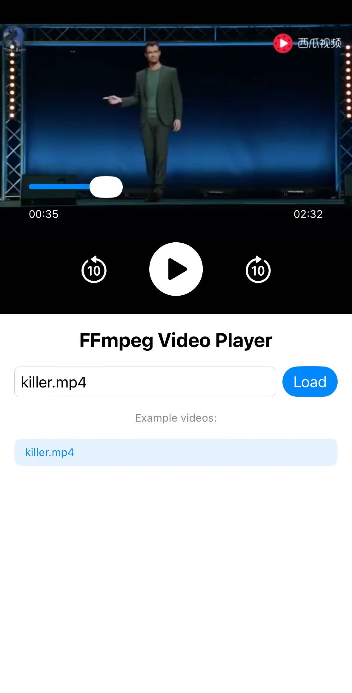

# iOS Player with FFmpeg

## Introduction
An iOS player that uses FFmpeg to play video. (Can not play audio now)

## Requirements
- iOS 12.0 or later (We have tested on iPhone16 with iOS26.2, simulators and x86_64 can not work if you use libs in this repo, you can build your own libs to replace third-party)
- FFmpeg 7.1.1 or later, earlier version may work but not tested

## Usage
1. Add third-party libs, VideoToolbox, AudioToolbox, CoreMedia frameworks and libiconv.tbd to your project.
2. Run

## Test figure

